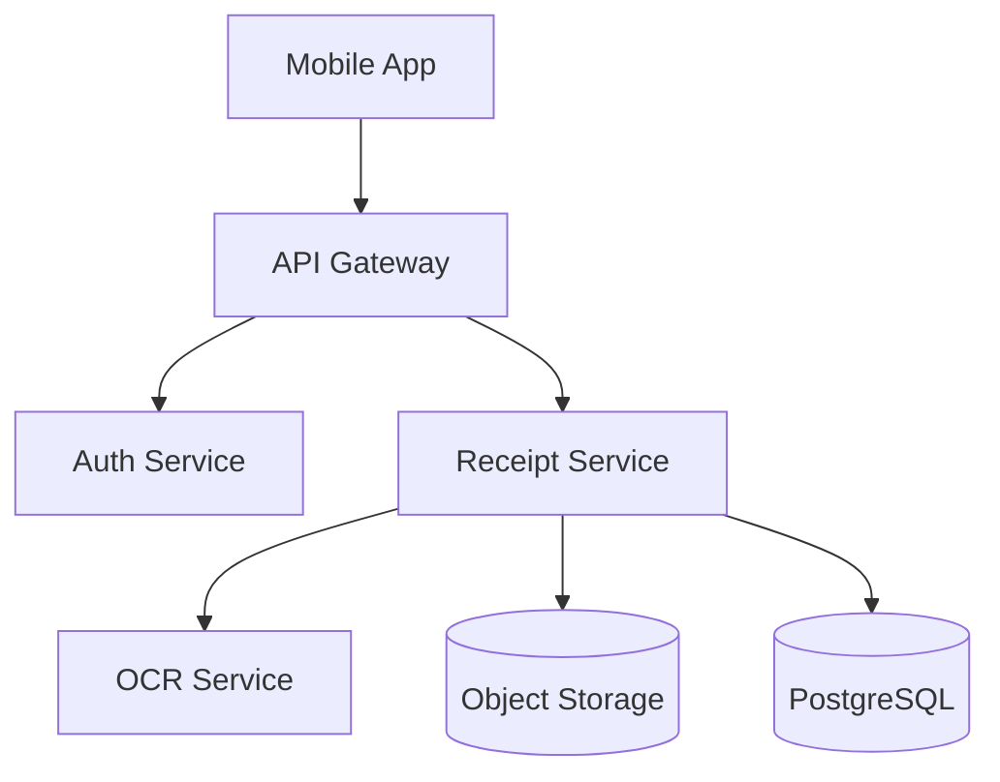

# Spec Writing

## Overview

Specification writing is the foundation of successful software development. This skill provides guidance on creating Product Requirements Documents (PRDs), Technical Specifications, and Functional Requirements documents that clearly communicate project goals, constraints, and implementation details.

## Purpose of Specifications

### Why Write Specifications

**Before implementation**:
- Clarify requirements and scope before coding
- Identify gaps and ambiguities early
- Establish shared understanding among stakeholders
- Provide basis for test cases
- Enable accurate effort estimation

**During development**:
- Reference for implementation decisions
- Communication tool for distributed teams
- Onboarding material for new team members
- Basis for code review criteria

**After delivery**:
- Historical record of design decisions
- Foundation for future enhancements
- Documentation for maintenance teams
- Evidence of requirements traceability

### Specifications in TDD Workflow

In TDD, specifications serve as the source of truth for test cases:

1. **PRD defines** → What to build and why
2. **Technical Spec defines** → How to build it
3. **Functional Requirements define** → Detailed behaviors
4. **Tests verify** → Requirements are met
5. **Implementation satisfies** → Tests

## Document Types

### Product Requirements Document (PRD)

**Purpose**: Define what to build and why it matters

**Audience**: Product managers, stakeholders, engineering teams

**Key sections**:
- Problem statement and user needs
- Proposed solution and features
- Success metrics and KPIs
- Scope boundaries (in/out of scope)
- User stories with acceptance criteria

**When to write**: At project inception, before technical design

**Template location**: `../../templates/prd-template.md`

### Technical Specification

**Purpose**: Define how to build the solution

**Audience**: Engineering teams, architects, technical reviewers

**Key sections**:
- System architecture and components
- Data models and API design
- Technology choices and rationale
- Performance and scalability considerations
- Security and error handling

**When to write**: After PRD approval, before implementation

**Template location**: `../../templates/technical-spec-template.md`

### Functional Requirements

**Purpose**: Define detailed behaviors and interactions

**Audience**: QA engineers, developers, business analysts

**Key sections**:
- Specific requirements with IDs (FR-001, FR-002, etc.)
- User workflows and interactions
- UI/UX requirements
- Business rules and validation
- Acceptance criteria with Given-When-Then format

**When to write**: Parallel with technical spec, before test writing

**Template location**: `../../templates/functional-requirements-template.md`

## Writing Effective PRDs

### Problem Statement

**Articulate the problem clearly**:

Good problem statement:
```
Current Situation:
Users spend an average of 15 minutes per day manually tracking
expense receipts across multiple apps, leading to incomplete
records and delayed reimbursements.

Impact:
- 60% of users report missing receipts
- Average reimbursement delay: 14 days
- Finance team spends 10 hours/week on follow-ups

Root Cause:
No unified interface for receipt capture and categorization
```

Poor problem statement:
```
Users need a better way to track expenses.
```

**Why the good example works**:
- Quantifies the problem
- Identifies who is affected
- Explains business impact
- States root cause

### User Stories

**Follow standard format**:

```
As a [user type]
I want [capability]
So that [benefit]

Acceptance Criteria:
- [ ] Specific, testable criterion 1
- [ ] Specific, testable criterion 2
- [ ] Specific, testable criterion 3
```

**Example**:
```
As a mobile user
I want to photograph receipts with my phone camera
So that I can capture expenses immediately without manual data entry

Acceptance Criteria:
- [ ] Camera opens from home screen within 2 taps
- [ ] Photo includes receipt date, vendor, and amount
- [ ] Receipt data is extracted via OCR with 95% accuracy
- [ ] User can confirm or edit extracted data before saving
- [ ] Receipt image is stored with transaction record
```

**Best practices**:
- Focus on user value, not technical features
- Keep stories small and independently deliverable
- Include measurable acceptance criteria
- Prioritize by business value
- Reference personas when available

### Success Metrics

**Define measurable outcomes**:

| Metric | Current | Target | Measurement Method |
|--------|---------|--------|-------------------|
| Receipt capture time | 3 min | 30 sec | Analytics tracking |
| Missing receipts | 60% | <5% | Monthly audit |
| Reimbursement cycle | 14 days | 3 days | Process metrics |
| User satisfaction | 2.8/5 | 4.5/5 | NPS survey |

**Characteristics of good metrics**:
- Specific and quantifiable
- Tied to business objectives
- Measurable with existing tools
- Baseline and target values
- Clear measurement methodology

### Scope Management

**In Scope**:
- Mobile receipt photo capture (iOS, Android)
- OCR extraction of key fields
- Manual edit capability
- Cloud storage and sync
- Basic expense categorization

**Out of Scope** (with rationale):
- Receipt scanning from desktop (Phase 2 - low priority)
- Multi-currency conversion (Phase 2 - 10% of users)
- Integration with accounting software (Phase 3 - enterprise feature)
- Expense approval workflows (Different product team)

**Why explicit out-of-scope matters**:
- Prevents scope creep
- Sets stakeholder expectations
- Documents deferred features
- Enables focused implementation

## Writing Effective Technical Specifications

### Architecture Documentation

**Provide context and diagrams**:

```markdown
## System Architecture

### High-Level Architecture



### Component Overview

#### Receipt Service
**Purpose**: Core receipt processing and management

**Responsibilities**:
- Accept receipt images from mobile clients
- Coordinate OCR extraction
- Store receipt metadata
- Provide receipt query API

**Interfaces**:
- Input: Multipart form data (image + metadata)
- Output: JSON receipt object with extracted fields

**Dependencies**:
- OCR Service for text extraction
- Object Storage for image persistence
- PostgreSQL for metadata storage
```

**Best practices**:
- Start with high-level overview
- Use diagrams to show relationships
- Define each component's purpose clearly
- Document interfaces and dependencies
- Include sequence diagrams for complex flows

### API Design

**Document endpoints comprehensively**:

```markdown
#### `POST /api/v1/receipts`
Upload a new receipt for processing.

**Authentication**: Required (Bearer token)

**Request**:
```http
POST /api/v1/receipts HTTP/1.1
Content-Type: multipart/form-data

{
  "image": <binary data>,
  "category": "meals",
  "notes": "Client dinner"
}
```

**Response** (201 Created):
```json
{
  "id": "rcpt_abc123",
  "status": "processing",
  "extractedData": null,
  "uploadedAt": "2025-01-15T10:30:00Z",
  "estimatedCompletionTime": "2025-01-15T10:30:30Z"
}
```

**Error Response** (400 Bad Request):
```json
{
  "error": {
    "code": "INVALID_IMAGE",
    "message": "Image format not supported",
    "supportedFormats": ["jpg", "png", "pdf"]
  }
}
```

**Rate Limiting**: 100 requests per minute per user
```

**Include**:
- Authentication requirements
- Request/response examples
- All possible error responses
- Rate limiting and quotas
- Versioning strategy

### Data Models

**Define schema with constraints**:

```typescript
interface Receipt {
  id: string;                    // UUID, unique identifier
  userId: string;                // FK to users table
  imageUrl: string;              // S3 object URL

  extractedData: {
    vendor: string | null;       // OCR extracted, max 255 chars
    date: Date | null;           // ISO 8601 format
    amount: number | null;       // Decimal(10,2), USD cents
    currency: string;            // ISO 4217 code, default "USD"
  };

  userOverrides: {               // User-edited values
    vendor?: string;
    date?: Date;
    amount?: number;
  };

  category: ExpenseCategory;     // Enum: meals, travel, office, etc.
  status: ProcessingStatus;      // Enum: uploading, processing, complete, failed

  metadata: {
    ocrConfidence: number;       // 0-100, OCR reliability score
    processingTimeMs: number;    // Performance metric
    retryCount: number;          // Error handling metric
  };

  createdAt: Date;               // Auto-set on insert
  updatedAt: Date;               // Auto-set on update
}
```

**Document**:
- Field types with precision
- Constraints and validation rules
- Default values
- Foreign key relationships
- Indexes for performance

### Technology Decisions

**Justify choices with tradeoffs**:

```markdown
## Technology Stack

### OCR Service: Google Cloud Vision API

**Rationale**:
- 95%+ accuracy for receipt text extraction
- Handles various image qualities and formats
- Managed service (no infrastructure)
- 1,000 free requests/month, then $1.50/1,000

**Alternatives Considered**:

**Tesseract (Open Source)**:
- Pros: Free, self-hosted, no API limits
- Cons: 85% accuracy, requires tuning, maintenance burden
- Decision: Accuracy too low for production use

**AWS Textract**:
- Pros: 93% accuracy, AWS integration
- Cons: $1.50/page (vs $0.0015 for Vision), no free tier
- Decision: 1000x more expensive for similar accuracy

**Trade-offs Accepted**:
- Vendor lock-in to Google Cloud
- Network latency for API calls
- Cost increases with scale (mitigated by caching)
```

**Document for each major decision**:
- Chosen technology
- Clear rationale
- Alternatives evaluated
- Pros and cons of each
- Trade-offs accepted

## Writing Effective Functional Requirements

### Requirement Structure

**Use consistent format**:

```markdown
### FR-001: Mobile Receipt Photo Capture

**Priority**: Critical

**Description**:
The mobile app shall provide a camera interface for users to
photograph receipts. The camera shall activate within 2 seconds
of user tap and capture images at minimum 2MP resolution.

**Acceptance Criteria**:
1. **Given** user is on home screen
   **When** user taps "Add Receipt" button
   **Then** device camera activates within 2 seconds

2. **Given** camera is active
   **When** user taps capture button
   **Then** photo is taken at ≥2MP resolution and preview displayed

3. **Given** photo preview is displayed
   **When** user taps "Use Photo"
   **Then** photo is queued for upload with loading indicator

**User Story**: US-005 (Receipt capture)

**Dependencies**: None

**Test Cases**: TC-001, TC-002, TC-003
```

**Key elements**:
- Unique ID for traceability
- Priority level
- Clear description with specifics
- Given-When-Then acceptance criteria
- Links to user stories and test cases

### Given-When-Then Format

**Structure for clarity**:

**Given** (preconditions):
- Initial system state
- User context and permissions
- Required data exists

**When** (action):
- User or system action
- Event that triggers behavior
- Single, specific action

**Then** (outcome):
- Expected system response
- Observable result
- Success conditions

**Example - Login Flow**:
```
Given user has valid credentials (email: user@test.com, password: Test123!)
  And user is on the login page
  And user account is active (not locked or suspended)
When user enters credentials and clicks "Login"
Then user is redirected to dashboard within 3 seconds
  And session cookie is set with 24-hour expiration
  And "Welcome back, [Name]" message is displayed
```

**Best practices**:
- One Given-When-Then per test scenario
- Be specific with values and timing
- Include both positive and negative cases
- Make assertions observable and measurable

### UI/UX Requirements

**Describe interactions precisely**:

```markdown
### Screen: Receipt Photo Preview

**Purpose**: Allow user to review and confirm captured receipt photo before processing.

**Elements**:
- **Header**: "Review Receipt" title, back arrow (← top-left)
- **Image Preview**: Full-width receipt photo, pinch-to-zoom enabled
- **Action Buttons**:
  - "Retake" (secondary, left): Returns to camera
  - "Use Photo" (primary, right): Proceeds to OCR extraction
- **Status Bar**: Shows upload queue count if offline

**Interactions**:
1. When user taps "Retake", return to camera without saving photo
2. When user pinches image, zoom in/out with smooth animation
3. When user taps "Use Photo":
   - Disable button and show loading spinner
   - Display "Processing receipt..." message
   - Navigate to receipt detail on completion

**Validation Rules**:
- Image file size < 10MB (show error if exceeded)
- Image dimensions ≥ 800x600 pixels (show warning if lower)

**Error States**:
- Network unavailable: Queue upload, show "Will upload when online"
- File too large: "Photo exceeds 10MB limit. Please retake."
- Processing failed: "Could not read receipt. Please retake or enter manually."

**Accessibility**:
- VoiceOver support for all interactive elements
- Minimum tap target size: 44x44 points
- Color contrast ratio: 4.5:1 for text
```

**Document**:
- Screen purpose
- All UI elements with positions
- User interactions with outcomes
- Validation rules
- Error states and messages
- Accessibility requirements

### Business Rules

**Capture constraints and logic**:

```markdown
### BR-001: Receipt Amount Validation

**Description**: System shall validate receipt amounts to prevent errors and fraud.

**Rules**:
1. Amount must be greater than $0.00
2. Amount must not exceed $10,000.00 (requires manager approval if higher)
3. Amount must match extracted OCR data within 10% tolerance (flag if diverges)
4. Amounts in foreign currency must be converted using rate from receipt date

**Examples**:
- User submits $50.00 receipt: ✓ Accepted
- User submits $0.00 receipt: ✗ Rejected with error
- User submits $15,000 receipt: ⚠ Flagged for approval
- OCR extracts $100, user edits to $200: ⚠ Flagged for review

**Exceptions**:
- Per-diem meals exempt from amount limits (BR-007)
- Foreign receipts < $100 USD equivalent exempt from conversion
```

**Include**:
- Clear rule statements
- Concrete examples
- Edge cases
- Exceptions to rules

## Specification Writing Process

### Step 1: Gather Information

**Activities**:
- Interview stakeholders
- Review existing documentation
- Analyze competitor solutions
- Research technical constraints
- Identify user pain points

**Outputs**:
- Stakeholder notes
- Requirements list
- Constraint summary
- Reference materials

### Step 2: Create PRD

**Start with problem**:
1. Write problem statement
2. Define success metrics
3. Draft user stories
4. Establish scope boundaries
5. Identify risks and mitigations

**Review with stakeholders**:
- Product managers
- Business owners
- Key users
- Executive sponsors

**Iterate until alignment achieved**

### Step 3: Develop Technical Spec

**Design architecture**:
1. Sketch high-level components
2. Define data models
3. Design API contracts
4. Choose technologies
5. Plan deployment strategy

**Review with engineers**:
- Technical leads
- Security team
- DevOps team
- Relevant domain experts

**Iterate until feasible**

### Step 4: Write Functional Requirements

**Detail behaviors**:
1. Break down user stories into requirements
2. Write Given-When-Then scenarios
3. Specify UI/UX interactions
4. Document business rules
5. Define acceptance criteria

**Review with QA**:
- Test engineers
- Product team
- UX designers

**Iterate until testable**

### Step 5: Link Specifications

**Create traceability**:
- User Story → Functional Requirements
- Functional Requirements → Test Cases
- Test Cases → Implementation Files

**Update specs manifest**:
```yaml
features:
  - name: receipt-capture
    specifications:
      prd: docs/specs/receipt-capture/prd.md
      technicalSpec: docs/specs/receipt-capture/technical-spec.md
      functionalRequirements: docs/specs/receipt-capture/requirements.md
```

## Common Specification Pitfalls

### Vague Requirements

**Problem**: Requirement lacks specificity

❌ **Bad**:
```
FR-001: System shall provide fast response times
```

✅ **Good**:
```
FR-001: API shall return receipt list within 200ms for p95 requests
Given user requests receipt list (up to 100 items)
When request is processed by API
Then response is returned within 200ms for 95% of requests
And remaining 5% complete within 500ms
```

### Implementation Masquerading as Requirements

**Problem**: Specifies "how" instead of "what"

❌ **Bad**:
```
FR-002: System shall use PostgreSQL database with JSONB column
for storing receipt metadata
```

✅ **Good**:
```
FR-002: System shall persist receipt metadata with retrieval time <50ms
Given receipt has been processed and stored
When user requests receipt by ID
Then receipt metadata is returned within 50ms
And metadata includes all extracted and user-edited fields
```

### Missing Acceptance Criteria

**Problem**: No way to verify requirement is met

❌ **Bad**:
```
FR-003: Users can edit receipt information
```

✅ **Good**:
```
FR-003: Users can edit receipt vendor, date, amount, and category

Given user views receipt detail
When user taps edit button and modifies vendor field
Then changes are saved within 2 seconds
And updated value displays immediately
And original OCR value is preserved for audit
```

### Ambiguous Terminology

**Problem**: Terms mean different things to different people

❌ **Bad**:
```
System shall process receipts quickly
```

✅ **Good**:
```
System shall complete OCR extraction within 30 seconds of receipt upload

Definitions:
- "Process": OCR text extraction and field parsing
- "Quickly": 30 seconds for 95% of receipts, 60 seconds for remaining 5%
- "Receipt": Single-page image in JPG, PNG, or PDF format, up to 10MB
```

## Specification Maintenance

### Keeping Specs Current

**Update triggers**:
- Scope changes during development
- New requirements discovered
- Technical constraints identified
- User feedback after release

**Process**:
1. Document change request
2. Assess impact on related docs
3. Update all affected sections
4. Increment version number
5. Notify stakeholders

**Version tracking**:
```markdown
## Change Log

| Date | Version | Changes | Author |
|------|---------|---------|--------|
| 2025-01-15 | 1.0.0 | Initial version | Alice |
| 2025-01-22 | 1.1.0 | Added bulk upload (FR-012) | Bob |
| 2025-02-05 | 1.2.0 | Updated OCR accuracy requirements | Alice |
```

### Traceability Matrix

**Maintain links between artifacts**:

| Requirement | User Story | Test Cases | Implementation |
|-------------|------------|------------|----------------|
| FR-001 | US-005 | TC-001, TC-002 | camera.service.ts |
| FR-002 | US-005 | TC-003, TC-004 | receipt.controller.ts |
| FR-003 | US-006 | TC-005 | receipt-edit.component.ts |

**Benefits**:
- Impact analysis for changes
- Coverage verification
- Gap identification
- Audit trail

## Using Specifications in TDD

### From Specs to Tests

**Conversion process**:

1. **Read functional requirement**:
```
FR-001: Camera activates within 2 seconds of button tap
```

2. **Identify test scenario**:
```
Test: Camera activation performance
```

3. **Write test case**:
```javascript
describe('Receipt Camera', () => {
  it('should activate camera within 2 seconds of tap', async () => {
    // Arrange
    const startTime = Date.now();

    // Act
    await user.tap('Add Receipt');
    await waitFor(() => expect(camera.isActive).toBe(true));

    // Assert
    const duration = Date.now() - startTime;
    expect(duration).toBeLessThan(2000);
  });
});
```

**Process**:
- Each functional requirement → One or more test cases
- Each Given-When-Then → Individual test
- Acceptance criteria → Test assertions

### Test Coverage from Requirements

**Ensure complete coverage**:

```yaml
# .claude/specs-manifest.yaml
features:
  - name: receipt-capture
    functionalRequirements: docs/specs/receipt-capture/requirements.md
    tests:
      - path: tests/camera.test.ts
        covers: [FR-001, FR-002]
      - path: tests/receipt-upload.test.ts
        covers: [FR-003, FR-004, FR-005]
    metrics:
      requirementsCovered: 5
      totalRequirements: 5
      coveragePercent: 100
```

**Track**:
- Requirements without tests (gaps)
- Tests without requirements (over-testing?)
- Coverage percentage

## Tools and Templates

### Available Templates

Use templates from `../../templates/`:

**PRD Template**: `prd-template.md`
- Complete structure with examples
- All standard sections pre-filled
- Prompts for key information

**Technical Spec Template**: `technical-spec-template.md`
- Architecture diagrams placeholders
- API documentation format
- Data model examples

**Functional Requirements Template**: `functional-requirements-template.md`
- Requirement format with IDs
- Given-When-Then structure
- Traceability matrix

### Commands for Specification Writing

**Interactive PRD creation**:
```
/tdd:create-prd
```

**Generate tech spec from PRD**:
```
/tdd:create-spec
```

**Start new feature with all specs**:
```
/tdd:start-feature receipt-capture
```

## Additional Resources

### Reference Files

For detailed patterns:
- **`references/prd-examples.md`** - Real-world PRD examples
- **`references/api-documentation.md`** - API spec best practices
- **`references/requirements-patterns.md`** - Common requirement patterns

### Example Files

Complete specifications in `examples/`:
- **`example-prd.md`** - Sample PRD for reference
- **`example-technical-spec.md`** - Sample technical spec
- **`example-requirements.md`** - Sample functional requirements

## Quick Reference

### PRD Checklist

- [ ] Clear problem statement with quantified impact
- [ ] User stories with acceptance criteria
- [ ] Success metrics with baselines and targets
- [ ] Explicit in-scope and out-of-scope items
- [ ] Risk assessment with mitigations
- [ ] Stakeholder approval documented

### Technical Spec Checklist

- [ ] Architecture diagram showing components
- [ ] Data models with constraints
- [ ] API endpoints with request/response examples
- [ ] Technology choices with rationale
- [ ] Security considerations documented
- [ ] Performance requirements specified
- [ ] Engineering team reviewed

### Functional Requirements Checklist

- [ ] Each requirement has unique ID
- [ ] Priority assigned (Critical/High/Medium/Low)
- [ ] Given-When-Then acceptance criteria
- [ ] Links to user stories and test cases
- [ ] UI/UX interactions specified
- [ ] Business rules documented
- [ ] QA team reviewed

### Given-When-Then Format

```
Given [preconditions and context]
  And [additional context]
When [user or system action]
Then [expected outcome]
  And [additional outcome]
  And [additional outcome]
```

Use this skill when creating specifications before writing tests or implementation code.
