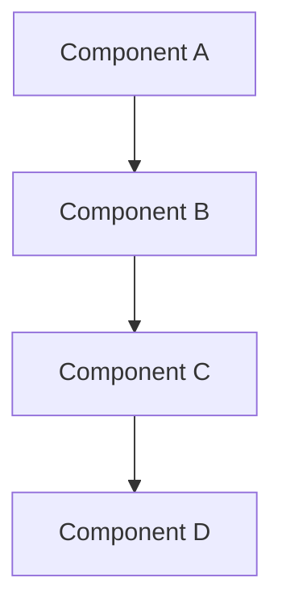
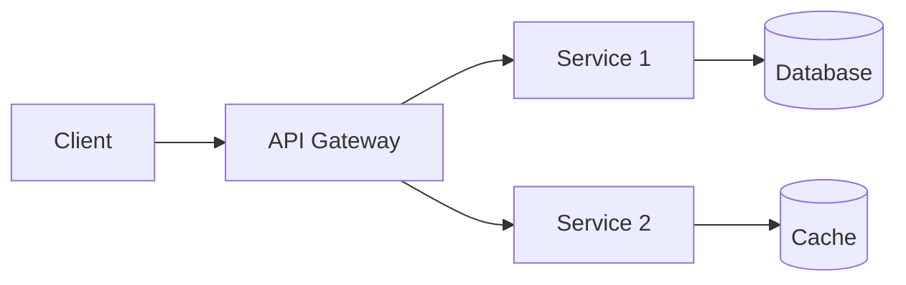
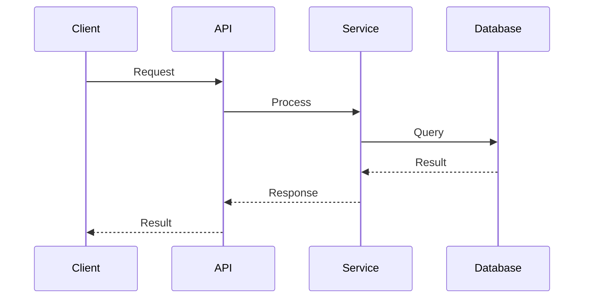

# [Feature Name] - Technical Specification

## Overview

### Purpose
Brief description of what this specification covers.

### Goals
- Goal 1: Description
- Goal 2: Description
- Goal 3: Description

### Non-Goals
- Non-goal 1: What this spec explicitly doesn't cover
- Non-goal 2: What this spec explicitly doesn't cover

## System Context

### Current System State
Description of relevant existing system components and their interactions.



### Proposed Changes
High-level overview of what will change.

## Architecture

### System Architecture



### Component Overview

#### Component 1: [Name]
**Purpose**: What this component does

**Responsibilities**:
- Responsibility 1
- Responsibility 2
- Responsibility 3

**Interfaces**:
- Input: Description
- Output: Description

#### Component 2: [Name]
**Purpose**: What this component does

**Responsibilities**:
- Responsibility 1
- Responsibility 2

**Interfaces**:
- Input: Description
- Output: Description

## Data Design

### Data Models

#### Model: [EntityName]
```typescript
interface EntityName {
  id: string;              // Unique identifier
  name: string;            // Entity name
  status: Status;          // Current status
  createdAt: Date;         // Creation timestamp
  updatedAt: Date;         // Last update timestamp
  metadata: Record<string, any>;  // Additional metadata
}
```

**Constraints**:
- `id` must be unique across all entities
- `name` must be non-empty and max 255 characters
- `status` must be one of: [DRAFT, ACTIVE, ARCHIVED]

#### Model: [EntityName2]
```typescript
interface EntityName2 {
  id: string;
  type: string;
  data: any;
}
```

### Data Flow



### Storage Strategy

**Primary Storage**: [Database type and rationale]

**Caching Strategy**: [Cache type and invalidation approach]

**Backup & Recovery**: [Strategy]

## API Design

### Endpoints

#### `POST /api/v1/resource`
Create a new resource.

**Request**:
```json
{
  "name": "string",
  "type": "string",
  "options": {
    "key": "value"
  }
}
```

**Response** (201 Created):
```json
{
  "id": "string",
  "name": "string",
  "type": "string",
  "status": "ACTIVE",
  "createdAt": "2025-01-01T00:00:00Z"
}
```

**Error Response** (400 Bad Request):
```json
{
  "error": {
    "code": "INVALID_INPUT",
    "message": "Validation failed",
    "details": [
      {
        "field": "name",
        "issue": "Required field missing"
      }
    ]
  }
}
```

#### `GET /api/v1/resource/{id}`
Retrieve a resource by ID.

**Parameters**:
- `id` (path, required): Resource identifier

**Response** (200 OK):
```json
{
  "id": "string",
  "name": "string",
  "type": "string",
  "status": "ACTIVE",
  "createdAt": "2025-01-01T00:00:00Z"
}
```

**Error Response** (404 Not Found):
```json
{
  "error": {
    "code": "NOT_FOUND",
    "message": "Resource not found"
  }
}
```

### Authentication & Authorization

**Authentication Method**: [e.g., JWT, OAuth2, API Key]

**Authorization Model**: [e.g., RBAC, ABAC]

**Required Permissions**:
- `resource:read`: Read access to resources
- `resource:write`: Create/update resources
- `resource:delete`: Delete resources

## Security Considerations

### Threat Model

| Threat | Impact | Mitigation |
|--------|--------|-----------|
| [Threat 1] | High/Med/Low | [Strategy] |
| [Threat 2] | High/Med/Low | [Strategy] |
| [Threat 3] | High/Med/Low | [Strategy] |

### Input Validation
- Validate all user inputs against schemas
- Sanitize inputs to prevent injection attacks
- Enforce rate limiting on API endpoints

### Data Protection
- Encrypt sensitive data at rest using [encryption method]
- Use TLS 1.3 for data in transit
- Implement proper access controls

### Audit Logging
- Log all authentication attempts
- Log all data modifications with user context
- Retain logs for [retention period]

## Performance Considerations

### Performance Requirements

| Metric | Target | Measurement |
|--------|--------|-------------|
| Response Time (p95) | < 200ms | API gateway metrics |
| Throughput | > 1000 req/sec | Load testing |
| Availability | 99.9% | Uptime monitoring |

### Optimization Strategies
- **Caching**: Cache frequently accessed data with [TTL]
- **Database**: Add indexes on [columns]
- **API**: Implement pagination for list endpoints
- **Client**: Enable compression and CDN

### Scalability
**Horizontal Scaling**: [Strategy and limits]

**Vertical Scaling**: [Strategy and limits]

**Bottlenecks**: [Known bottlenecks and mitigation]

## Error Handling

### Error Codes

| Code | HTTP Status | Description | User Action |
|------|-------------|-------------|-------------|
| INVALID_INPUT | 400 | Request validation failed | Fix input and retry |
| UNAUTHORIZED | 401 | Authentication failed | Provide valid credentials |
| FORBIDDEN | 403 | Insufficient permissions | Contact administrator |
| NOT_FOUND | 404 | Resource not found | Check resource ID |
| CONFLICT | 409 | Resource conflict | Resolve conflict |
| INTERNAL_ERROR | 500 | Server error | Retry or contact support |

### Retry Logic
- Implement exponential backoff for transient errors
- Maximum retry attempts: 3
- Do not retry on 4xx errors (except 429)

### Graceful Degradation
- [Strategy for when dependencies fail]
- [Fallback behavior]

## Deployment

### Deployment Strategy
[Blue-green, canary, rolling update, etc.]

### Configuration
**Environment Variables**:
```bash
API_KEY=<secret>
DATABASE_URL=<connection-string>
CACHE_TTL=3600
LOG_LEVEL=info
```

**Feature Flags**:
- `feature.new_api_enabled`: Enable new API endpoints
- `feature.legacy_mode`: Enable compatibility mode

### Rollback Plan
1. Step 1: [Action]
2. Step 2: [Action]
3. Step 3: [Action]

## Testing Strategy

### Unit Tests
- Test all business logic functions
- Target coverage: 90% line, 85% branch
- Mock external dependencies

### Integration Tests
- Test API endpoints end-to-end
- Test database interactions
- Test cache behavior

### Performance Tests
- Load testing with [tool]
- Stress testing to identify limits
- Soak testing for memory leaks

### Security Tests
- Penetration testing
- Dependency vulnerability scanning
- OWASP Top 10 validation

## Monitoring & Observability

### Metrics
- Request rate and latency (p50, p95, p99)
- Error rate by endpoint and status code
- Database query performance
- Cache hit/miss ratio

### Alerts
| Alert | Condition | Severity | Action |
|-------|-----------|----------|--------|
| High Error Rate | Error rate > 5% | Critical | Page on-call |
| Slow Response | p95 latency > 500ms | Warning | Investigate |
| Low Availability | Uptime < 99.9% | Critical | Page on-call |

### Logging
- Structured logging in JSON format
- Include correlation IDs for request tracing
- Log levels: DEBUG, INFO, WARN, ERROR

### Tracing
- Distributed tracing with [tool]
- Trace all external calls
- Include database query traces

## Dependencies

### External Dependencies
| Dependency | Version | Purpose | Criticality |
|------------|---------|---------|-------------|
| [Library 1] | ^2.0.0 | [Purpose] | High |
| [Library 2] | ^1.5.0 | [Purpose] | Medium |

### Internal Dependencies
| Service | API | Criticality |
|---------|-----|-------------|
| [Service 1] | v2 | High |
| [Service 2] | v1 | Low |

## Migration Plan

### Prerequisites
1. Prerequisite 1
2. Prerequisite 2

### Migration Steps
1. **Step 1**: Description
   - Substep 1.1
   - Substep 1.2
2. **Step 2**: Description
   - Substep 2.1
   - Substep 2.2

### Data Migration
- Source: [Description]
- Target: [Description]
- Strategy: [Strategy]
- Validation: [How to verify]

### Backward Compatibility
- Maintain compatibility for [duration]
- Deprecation warnings in [version]
- Removal in [version]

## Open Questions

1. **Question 1**: Context and blocking/non-blocking
2. **Question 2**: Context and blocking/non-blocking

## Appendix

### Alternative Approaches Considered

#### Approach 1: [Name]
**Pros**:
- Pro 1
- Pro 2

**Cons**:
- Con 1
- Con 2

**Decision**: Rejected because [reason]

#### Approach 2: [Name]
**Pros**:
- Pro 1
- Pro 2

**Cons**:
- Con 1
- Con 2

**Decision**: Rejected because [reason]

### References
- [Reference 1]: Description/Link
- [Reference 2]: Description/Link

### Glossary
- **Term 1**: Definition
- **Term 2**: Definition

### Change Log

| Date | Version | Changes | Author |
|------|---------|---------|--------|
| YYYY-MM-DD | 0.1.0 | Initial draft | [Name] |
